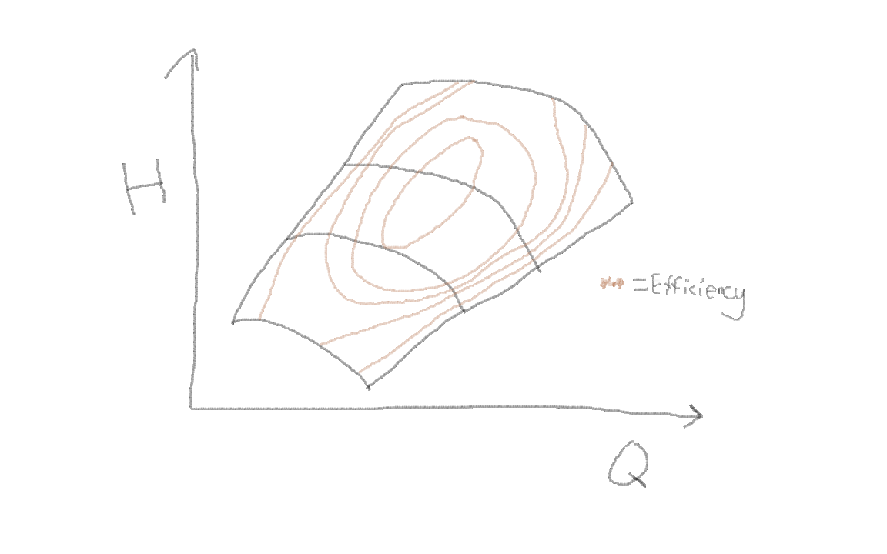

# Ops-CompressorMapInterpolationForUniSim
A drawn compressor map on the form: 

$E (H, Q, rpm = Fixed)$

Where:  
$E = Efficiency$, 
$H = Head$, 
$Q = Volumetric Flow$, 
$rpm = Revolutions per Minute$, 

<em>Compressor Map: Drawn by Jørgen Skjæveland, age 26</em>

A compressor map like the one in <a href="#compressor-map">the figure above</a> contains Head, Volumetric flow and Efficiency in a single plot. This makes it more difficult to determine what the efficiency is for a given Head and Volumetric flow.

The Python code takes in a csv-file with the discrete points (Head, Q), which each represents a known Efficiency. The program performes a Numpy Polynomial interpolation to determine efficiency between the known points. The program produces a tsv-file with n number (25 by standard) of evenly spread points with the columns <em>Flow [m3/h],  Head [kJ/kg],  Efficiency [%]<em> 

