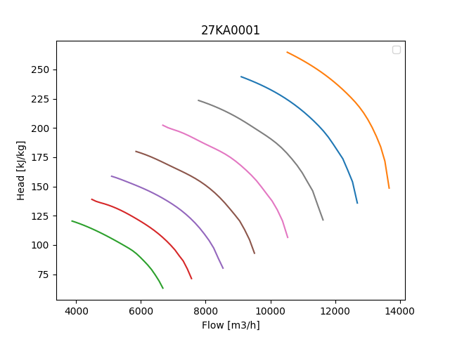
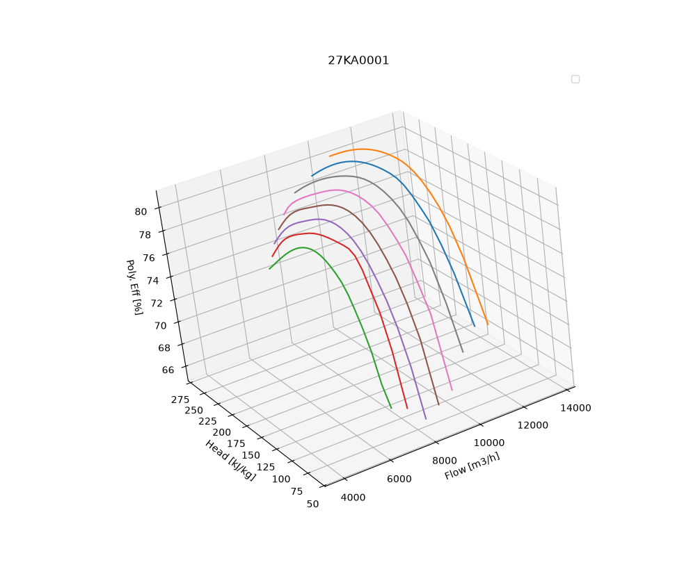

# ops-UniSim-RotatingEquipment-CurveInterpolation
Some vendors supply a compressor map as shown  below. The Compressor map show head, H, on the y-axis and volumetric flow, Q, on the x-axis. Efficiency, E, is represented by the contour lines within the map. The rotational speed yielding the different relaptionship between head, flow and efficiency is typically indicated by separate curves or annotations within the map. A handrawn example is provided in the <a href="#compressor-map">figure below</a>.

The map is practical for viewing. However, it can be challenging to extract precise numerical values for efficiency at specific operating points directly from the visual representation. This script provides a method to interpolate efficiency values based on known data points, allowing for more accurate analysis and utilization of the compressor map.

$E (H, Q, rpm)$


Where:  
$E = Efficiency$, 
$H = Head$, 
$Q = Volumetric Flow$, 
$rpm = Revolutions per Minute$, 


<p><em>Compressor Map: Drawn by Jørgen Skjæveland, age 26</em></p>

## Interpolating Efficiency from the Compressor Map

The idea is to generate a continuous representation of efficiency values across the entire compressor map, based on the discrete data points provided. This allows for more accurate determination of efficiency at any given operating point within the map.

The calculation principle is as follows:

1. The scripts looks for csv-files containing the discrete data points for Head, Volumetric Flow, and Efficiency. This data would have to be prepared in advance. A method is to use a digitizing tool to extract the data points from the compressor map image. The folowing requirements should be met:

   - The csv-file should have columns for Volumetric Flow, Head, and Efficiency. In that order.
   - No header for the columns.
   - Each row should represent a single data point.
   - The data should cover the entire operating range of the compressor as represented in the map.
   - The file should have a suitable name.
2. The script reads the csv-files and extracts the discrete data points for Head, Volumetric Flow, and Efficiency.
3. The extracted data points are then used to perform a Numpy Polynomial interpolation or cubic spline interpolation, depending on the chosen method. This will create a smooth curve of efficiency values, generating a continuous representation of efficiency values, as well as Head and Volumetric Flow across the compressor map.
4. The interpolated efficiency values are saved to a new tsv-file, in the folder named "RotatingEquipmentDataForUniSim". A tsv-file provides a convenient way to copy and paste the values into a UniSim Rotating Equipment model. 

### How to use the code
1. Clone the repository to your local machine.

2. Install the required libraries using pip:

```
pip install pandas numpy matplotlib pathlib scipy
```
Alternatively, if you use UV, you can run:
```
uv add numpy pandas matplotlib pathlib scipy
```

## Output

The output of the script includes:

- A tsv-file containing the interpolated efficiency values, saved in the folder named "RotatingEquipmentDataForUniSim".
- Plots visualizing the interpolation results, which help verify the accuracy of the generated efficiency curves.
- 3D-plot visualizing all speed curves and their respective efficiency, head and volumetric flow values. This plot is not saved as a file, but is displayed interactively for visual inspection.

### Example Figures

#### Full Head-Flow Curve

An example of the full 2D-curve is given in the <a href="images/27KA0001.png">figure below:</a>




#### Efficiency Curves

The Efficiency curves for the compressor speeds will look similar to the <a href="images/Efficiency Curve - 80prct_27KA0001.png">figure below:</a>


#### Head Curves

The head curves for the compressor speed will look similar to the <a href="images/Head Curve - 80prct_27KA0001.png">figure below:</a>


#### Snapshot of the 3D Plot

A snapshot of the 3D plot is shown in the <a href="images/FullCompressorMapFor27KA0001.png">figure below:</a>



## Closing remarks

Another script for generating the surge and stonewall curves are available in the repository called "ops-UniSim-RotatingEquipment-SurgeAndStonewallCurves". This script allows the user to generate and create control lines with a specified margin towards the surge and stonewall limits of the compressor map. This may be usefull for more currect operation and safety analysis of the compressor map in UniSim.

I'm always open for suggestions on how to improve the code or the method used to calculate the surge and stone wall curves. Feel free to open an issue or submit a pull request if you have any ideas or improvements.
